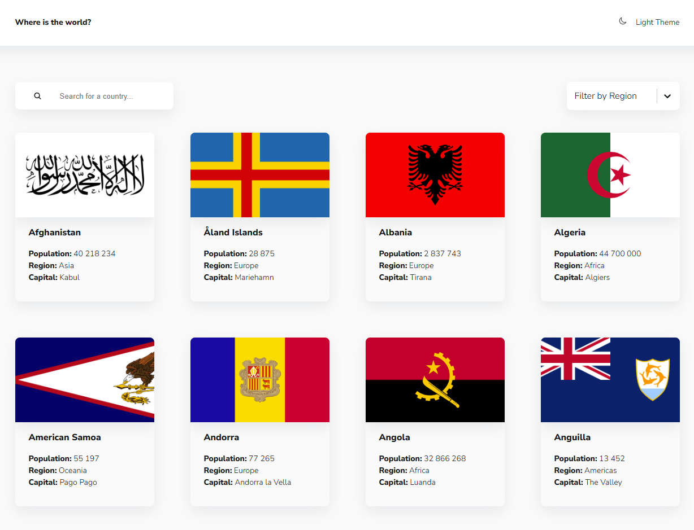
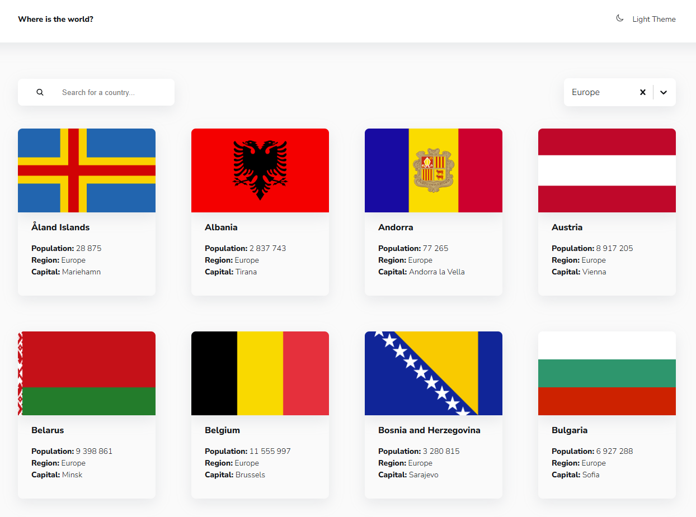
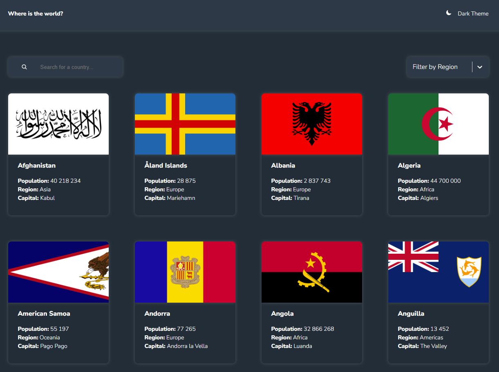

# Country Flags

Проект написан на языке TypeScript с использованием библиотеки React и собран при помощи Vite

## Описание

Страница для изучения стран мира с детальной информацией.

## Особенности

1. Детальная информация по каждой стране:
   -  Официальное название
   -  Столица
   -  Население
   -  Регион
   -  Языки
   -  Валюта
2. Поиск стран по названию

3. Фильтрация по региону

4. Адаптивный дизайн

 

5. Возможность смены темы оформления

## Технологии

Проект разработан с использованием следующих технологий:

-  HTML5
-  CSS3
-  Styled Components 6.1
-  TypeScript 5.7
-  React 19.1
-  React Router 7.6
-  React Redux 9.2 + Redux-Toolkit 2.8

## Контакты

Если у вас есть вопросы или предложения, пожалуйста, свяжитесь со мной по telegram: @demargorn или электронной почте: __demargorn@gmail.com__.
